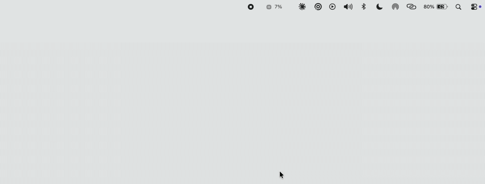

# Loady

A macOS menu bar system monitor, written from scratch in Swift 6.

<p align="center">
  
</p>

<p align="center">
  <a href="https://github.com/colangeloz/loady/releases/latest"></a>
  
  
  
  <a href="LICENSE"></a>
</p>

> **Status: early development.** CPU, memory, disk and GPU work; network and
> sensors are not built yet.

[**Download the latest release**](https://github.com/colangeloz/loady/releases/latest) — signed and notarized, so it opens without a Gatekeeper warning.

Universal binary — Intel and Apple Silicon, macOS 14 and later.

## What it measures

| Metric | Source | Checked against |
|---|---|---|
| CPU load, per core and per tier | `host_processor_info` | `top -l 2 -o cpu` |
| CPU topology | `hw.nperflevels`, `hw.perflevelN.*` | `system_profiler` |
| Memory used / wired / compressed | `host_statistics64(HOST_VM_INFO64)` | `vm_stat`, Activity Monitor |
| Pressure and swap | `kern.memorystatus_vm_pressure_level`, `vm.swapusage` | `memory_pressure` |

Core tiers are read from the kernel rather than assumed: an M5 Pro reports
`Super` and `Performance` with no efficiency tier at all.

## Architecture

```
IOKit / Mach  →  MetricReader  (non-Sendable: owns mach ports, IOKit handles)
                       │
                  actor Sampler  ──►  AsyncStream<Sample>
                       │
     ══════════════════╪══════════════════  the only isolation boundary
                       │
                 @MainActor  ──►  menu bar (AppKit) + panel (SwiftUI)
```

Readers are deliberately not `Sendable`, so the compiler confines them to their
sampler. One `await` per module carries values to the UI. Swift 6 language
mode, complete strict-concurrency checking, no `DispatchQueue.main.async`.

Idle cost on an M5 Pro, Release build: **0.6% CPU, 16 MB**.

## Not doing

Not sandboxed, so not on the Mac App Store — SMC and IOReport need IOKit user
clients that App Sandbox denies. No fan control: firmware rejects SMC writes on
M3 and later. No per-process CPU for other users; that needs a root helper.

## Building

Requires Xcode 26 or later.

```
git clone https://github.com/colangeloz/loady.git
cd loady && open Loady.xcodeproj
```

`swift test --package-path Core` runs the metrics layer alone — no app bundle,
no signing, no test host.

## License

MIT — see [LICENSE](LICENSE).
